<h2>TensorFlow-FlexUNet-Image-Segmentation-KneeBones3Dify (2026/02/28)</h2>
Sarah T.  Arai 
Software Laboratory antillia.com  
This is the first experiment of Image Segmentation for <b>KneeBones3Dify</b> based on our <a href="./src/TensorFlowFlexUNet.py">TensorFlowFlexUNet</a> 
(TensorFlow Flexible UNet Image Segmentation Model for Multiclass), 
and a 512x512 pixels
<a href="https://drive.google.com/file/d/1vVC1m3zo6YcTwu0Q1uts5czYN2NgLiYg/view?usp=sharing">
<b>Augmented-KneeBones3Dify-ImageMask-Dataset.zip</b></a> which was derived by us from   
<a href="https://zenodo.org/records/10534328">
<b>KneeBones3Dify-Annotated-Dataset v1.0.0</b> </a> on the zenodo.org.
  
<b>Data Augmentation Strategy</b> 
To address the limited size of images and masks of the original <b>KneeBones3Dify-Annotated-Dataset</b> dataset, 
we used our offline augmentation tool <a href="./generator/ImageMaskDatasetGenerator.py">ImageMaskDatasetGenerator.py</a> 
 to generate the augmented dataset.
    

<b>Actual Image Segmentation for KneeBones3Dify Images of  512x512 pixels </b> 
As shown below, the inferred masks predicted by our segmentation model trained by the dataset appear similar to the ground truth masks.
  
<table>
<tr>
<th>Input: image</th>
<th>Mask (ground_truth)</th>
<th>Prediction: inferred_mask</th>
</tr>
<tr>
<td>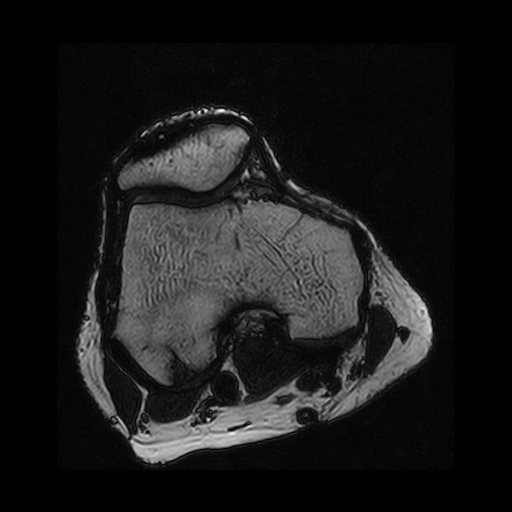</td>
<td></td>
<td></td>
</tr>

<tr>
<td>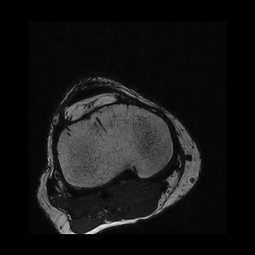</td>
<td></td>
<td></td>
</tr>

<tr>
<td>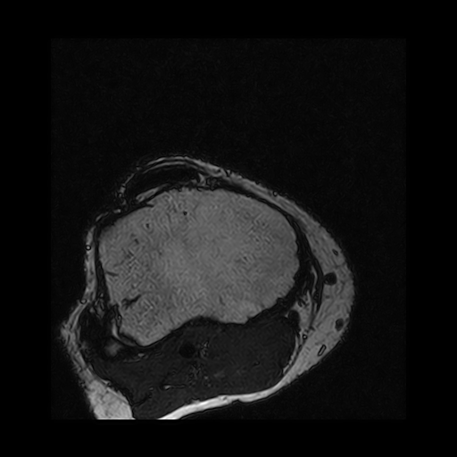</td>
<td></td>
<td></td>
</tr>
</table>

 
<h3>1  Dataset Citation</h3>
The dataset used here was derived from   
<a href="https://zenodo.org/records/10534328">
<b>KneeBones3Dify-Annotated-Dataset v1.0.0</b> </a> on the zenodo.org.
  
The following explanation was taken from the zenodo.org web site.
  
MRI T2-weighted without fat suppression, with knee bones ground truth masks.
  
<b>Citation</b>
Soscia, E., Romano, D., Maddalena, L., Gregoretti, F., De Lucia, G., & Antonelli, L. (2024). 
 KneeBones3Dify-Annotated-Dataset v1.0.0 (V1.0.0) [Data set]. Zenodo. 
 https://doi.org/10.5281/zenodo.10534328
  
<b>License</b> 
<a href="https://creativecommons.org/licenses/by/4.0/legalcode">Creative Commons Attribution 4.0 International</a>
 
 
<h3>
2 KneeBones3Dify ImageMask Dataset
</h3>
 If you would like to train this KneeBones3Dify Segmentation model by yourself,
please down load our dataset <a href="https://drive.google.com/file/d/1vVC1m3zo6YcTwu0Q1uts5czYN2NgLiYg/view?usp=sharing">
<b>Augmented-KneeBones3Dify-ImageMask-Dataset.zip</b>
</a> on the google drive, expand the downloaded, and put it under <b>./dataset/</b> to be.
<pre>
./dataset
└─KneeBones3Dify
    ├─test
    │   ├─images
    │   └─masks
    ├─train
    │   ├─images
    │   └─masks
    └─valid
        ├─images
        └─masks
</pre>

<b>KneeBones3Dify Statistics</b> 
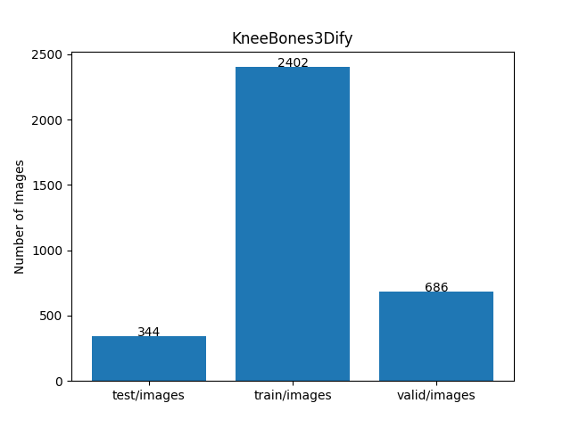 
 
As shown above, the number of images of train and valid datasets is not enough to use for a training set of our segmentation model.
  

<b>Train_images_sample</b> 
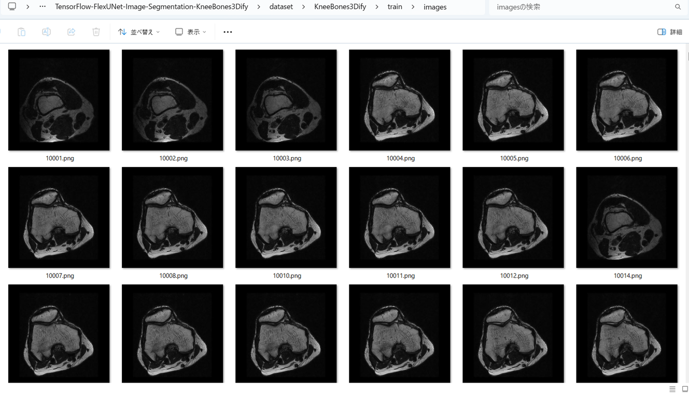
 
<b>Train_masks_sample</b> 
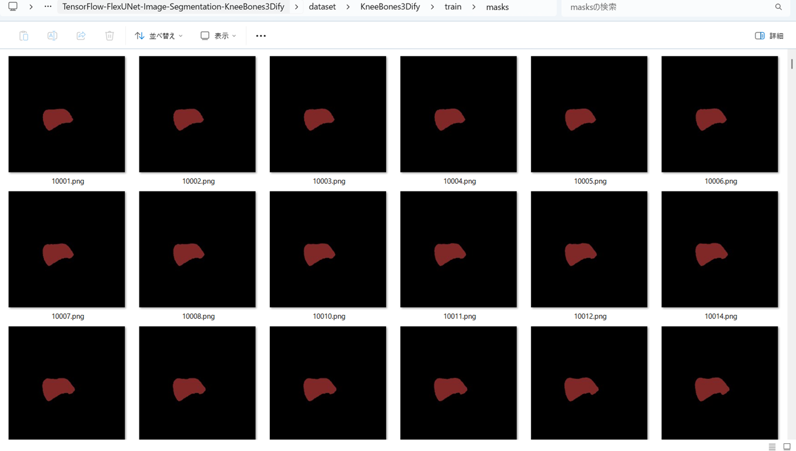
 
<h3>
3 Train TensorflowFlexUNet Model
</h3>
 We trained KneeBones3Dify TensorflowFlexUNet Model by using the following
<a href="./projects/TensorFlowFlexUNet/KneeBones3Dify/train_eval_infer.config"> <b>train_eval_infer.config</b></a> file.  
Please move to ./projects/TensorFlowFlexUNet/KneeBones3Dify, and run the following bat file. 
<pre>
>1.train.bat
</pre>
, which simply runs the following command. 
<pre>
>python ../../../src/TensorFlowFlexUNetTrainer.py ./train_eval_infer.config
</pre>

<b>Model parameters</b> 
Defined a small <b>base_filters=16</b> and a large <b>base_kernels=(11,11)</b> for the first Conv Layer of Encoder Block of 
<a href="./src/TensorFlowFlexUNet.py">TensorFlowFlexUNet.py</a> 
and a large num_layers (including a bridge between Encoder and Decoder Blocks).
<pre>
[model]
image_width    = 512
image_height   = 512
image_channels = 3
input_normalize = True
normalization  = False
num_classes    = 2
base_filters   = 16
base_kernels  = (11,11)
num_layers    = 8
dropout_rate   = 0.05
dilation       = (1,1)
</pre>
<b>Learning rate</b> 
Defined a small learning rate.  
<pre>
[model]
learning_rate  = 0.00007
</pre>
<b>Loss and metrics functions</b> 
Specified "categorical_crossentropy" and "dice_coef_multiclass". 
<pre>
[model]
loss           = "categorical_crossentropy"
metrics        = ["dice_coef_multiclass"]
</pre>
<b >Learning rate reducer callback</b> 
Enabled learing_rate_reducer callback, and a small reducer_patience.
<pre> 
[train]
learning_rate_reducer = True
reducer_factor     = 0.5
reducer_patience   = 4
</pre>
<b>Early stopping callback</b> 
Enabled early stopping callback with patience parameter.
<pre>
[train]
patience      = 10
</pre>
<b></b> 
<b>RGB color map</b> 
rgb color map dict for KneeBones3Dify 1+1 classes. 
<pre>
[mask]
mask_file_format = ".png"
;KneeBones3Dify 1+1
rgb_map = {(0,0,0):0,  (128, 40, 40):1, }
</pre>
<b>Epoch change inference callbacks</b> 
Enabled epoch_change_infer callback. 
<pre>
[train]
epoch_change_infer       = True
epoch_change_infer_dir   =  "./epoch_change_infer"
epoch_changeinfer        = False
epoch_changeinfer_dir    = "./epoch_changeinfer"
num_infer_images         = 6
</pre>
By using this epoch_change_infer callback, on every epoch_change, the inference procedure can be called
 for 6 images in <b>mini_test</b> folder. This will help you confirm how the predicted mask changes 
 at each epoch during your training process.    
<b>Epoch_change_inference output at starting (1,2,3)</b> 
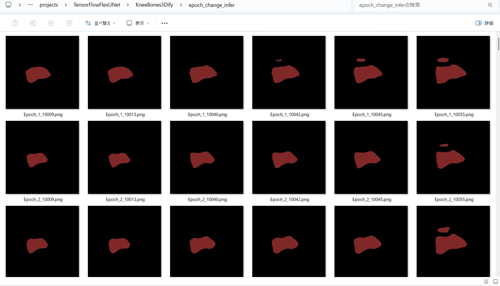 
 
<b>Epoch_change_inference output at middle-point (28,29,30)</b> 
 
 
<b>Epoch_change_inference output at ending (58,59,60)</b> 
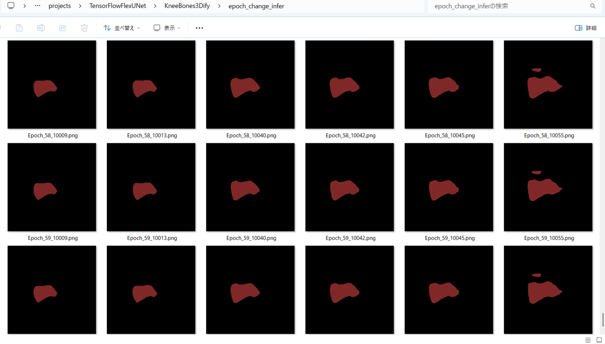 

 
In this experiment, the training process was terminated at epoch 60.  
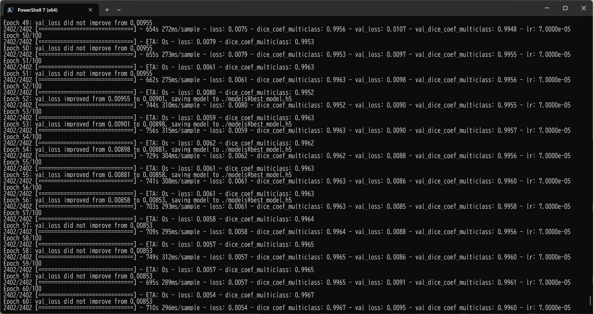 
 
<a href="./projects/TensorFlowFlexUNet/KneeBones3Dify/eval/train_metrics.csv">train_metrics.csv</a> 
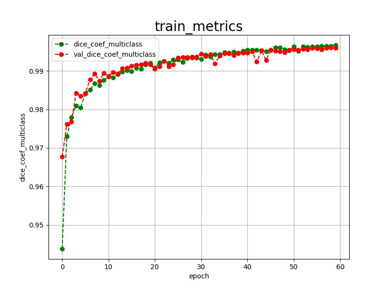 

 
<a href="./projects/TensorFlowFlexUNet/KneeBones3Dify/eval/train_losses.csv">train_losses.csv</a> 
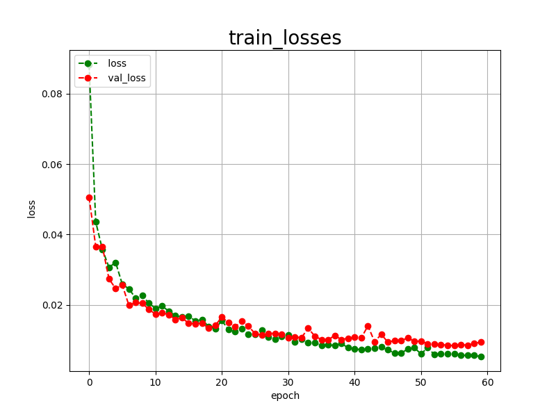 
 
<h3>
4 Evaluation
</h3>
Please move to a <b>./projects/TensorFlowFlexUNet/KneeBones3Dify</b> folder, and run the following bat file to evaluate TensorflowFlexUNet model for KneeBones3Dify. 
<pre>
>./2.evaluate.bat
</pre>
This bat file simply runs the following command.
<pre>
>python ../../../src/TensorFlowFlexUNetEvaluator.py  ./train_eval_infer.config
</pre>
Evaluation console output: 
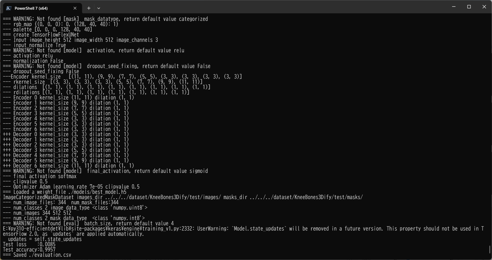
  Image-Segmentation-KneeBones3Dify

<a href="./projects/TensorFlowFlexUNet/KneeBones3Dify/evaluation.csv">evaluation.csv</a> 
The loss (categorical_crossentropy) to this KneeBones3Dify/test was very low, and dice_coef_multiclass  very high as shown below.
 
<pre>
categorical_crossentropy,0.0085
dice_coef_multiclass,0.9957
</pre>
 
<h3>5 Inference</h3>
Please move to a <b>./projects/TensorFlowFlexUNet/KneeBones3Dify</b> folder, and run the following bat file to infer segmentation regions for images by the Trained-TensorflowFlexUNet model for KneeBones3Dify. 
<pre>
>./3.infer.bat
</pre>
This simply runs the following command.
<pre>
>python ../../../src/TensorFlowFlexUNetInferencer.py ./train_eval_infer.config
</pre>

<b>mini_test_images</b> 
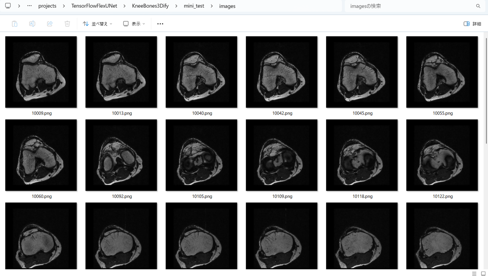 
<b>mini_test_mask(ground_truth)</b> 
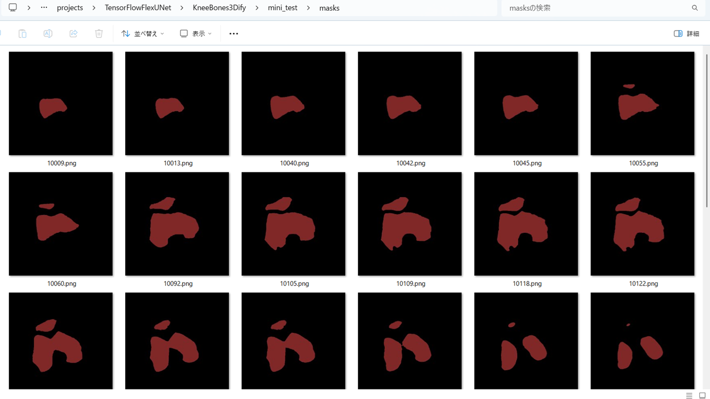 

<b>Inferred test masks</b> 
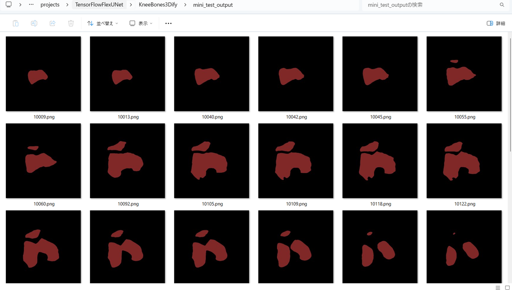 
 

<b>Enlarged images and masks for  KneeBones3Dify  Images of 512x512 pixels</b> 
As shown below, the inferred masks predicted by our segmentation model trained by the dataset appear similar to the ground truth masks.
 
 
<table>
<tr>
<th>Input: image</th>
<th>Mask (ground_truth)</th>
<th>Prediction: inferred_mask</th>
</tr>
<tr>
<td>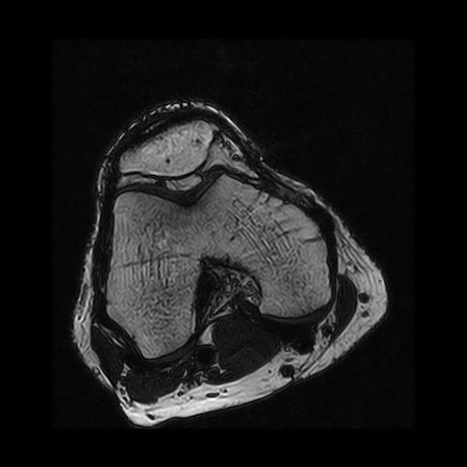</td>
<td></td>
<td></td>
</tr>

<tr>
<td>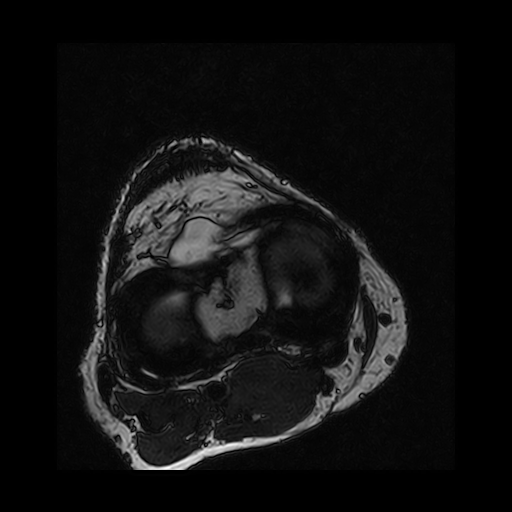</td>
<td></td>
<td></td>
</tr>

<tr>
<td>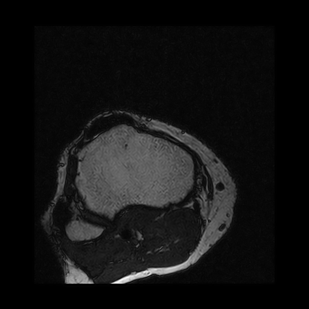</td>
<td></td>
<td></td>
</tr>
<tr>
<td>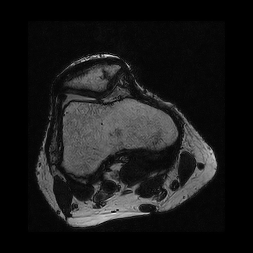</td>
<td></td>
<td></td>
</tr>
<tr>
<td>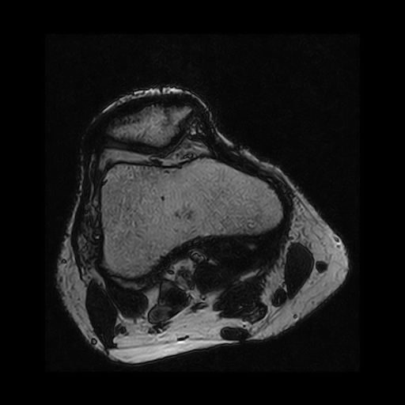</td>
<td></td>
<td></td>
</tr>
<tr>
<td>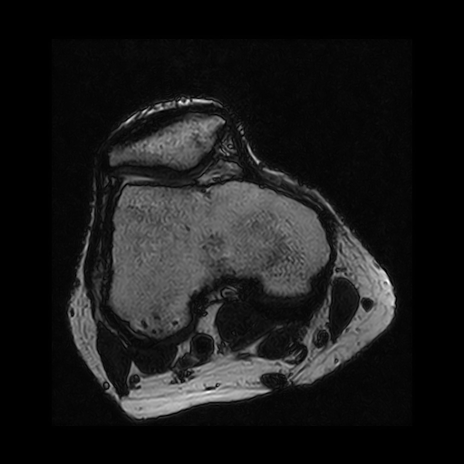</td>
<td></td>
<td></td>
</tr>
</table>

 
<h3>
References
</h3>
<b>1. Bone Segmentation in Low-Field Knee MRI Using a Three-Dimensional Convolutional Neural Network</b> 
Ciro Listone, Diego Romano and Marco Lapegna 
<a href="https://www.mdpi.com/2504-2289/9/6/146">
https://www.mdpi.com/2504-2289/9/6/146</a>
 
 
<b>2. KneeBones3Dify: Open-source software for segmentation and 3D reconstruction of knee bones from MRI data</b> 
Lucia Maddalena, Diego Romano, Francesco Gregoretti, Gianluca De Lucia, Laura Antonelli, Ernesto Soscia, Gabriele Pontillo,  
Carla Langella, Flavio Fazioli, Carla Giusti, Rosario Varriale  
<a href="https://www.sciencedirect.com/science/article/pii/S2352711024002255">
https://www.sciencedirect.com/science/article/pii/S2352711024002255
</a>
 
 
<b>3. TensorFlow-FlexUNet-Image-Segmentation-Model</b> 
Toshiyuki Arai  
<a href="https://github.com/sarah-antillia/TensorFlow-FlexUNet-Image-Segmentation-Model">
https://github.com/sarah-antillia/TensorFlow-FlexUNet-Image-Segmentation-Model
</a>
 
 
